# Abuse Stories — ClinicWave (Group 102)

Derived from LINDDUN privacy threat analysis. Each story maps to one or more STRIDE categories and an attack tree in the documentation repository.

---

## AS-01 — Unauthorised Access to Patient Data

| Field | Detail |
|---|---|
| **LINDDUN** | Disclosure — Critical |
| **Abuse Case** | As a malicious external user, I want to access another patient's personal data so that I can obtain sensitive information such as name, email, phone number, date of birth, and linked appointment data. |
| **How** | The attacker sends direct requests to `/api/patients` and `/api/appointments` and retrieves records without any access control, as no authentication mechanism exists in the system. |
| **Impact** | Exposure of personal and appointment-related data, leading to a privacy breach. |
| **Part 2 Status** | **Prevented** — Spring Security + JWT RS256 blocks all unauthenticated access. |

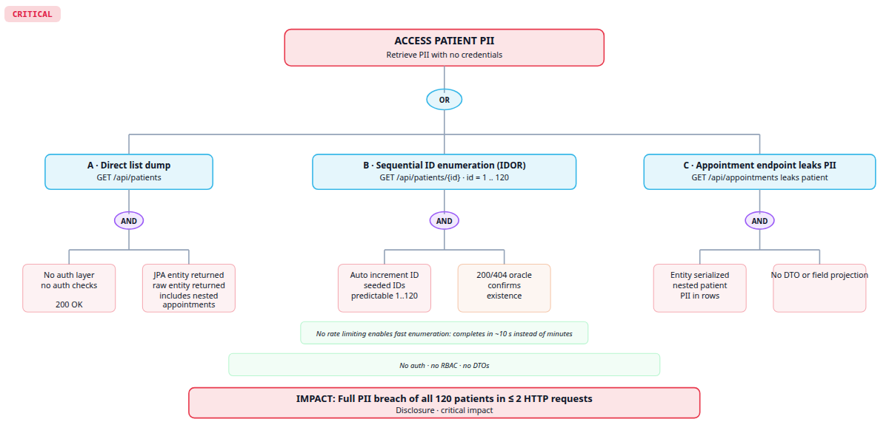

**Part 2 Regression:**

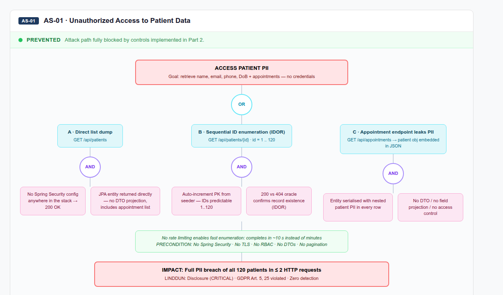

---

## AS-02 — Link Patient Identity to Appointment History

| Field | Detail |
|---|---|
| **LINDDUN** | Linking — Critical |
| **Abuse Case** | As a malicious external user, I want to associate patient identity data with appointment records so that I can infer sensitive patterns such as recurring specialties and possible health-related conditions. |
| **How** | The attacker correlates the full patient list with appointment records through linked identifiers. Both endpoints were unauthenticated and returned all records without pagination, making full profiling possible in two requests. |
| **Impact** | Sensitive health patterns can be inferred from metadata alone, increasing patient profiling risk beyond what any single record reveals. |
| **Part 2 Status** | **Prevented** — Authentication required; RBAC restricts cross-patient data access. |

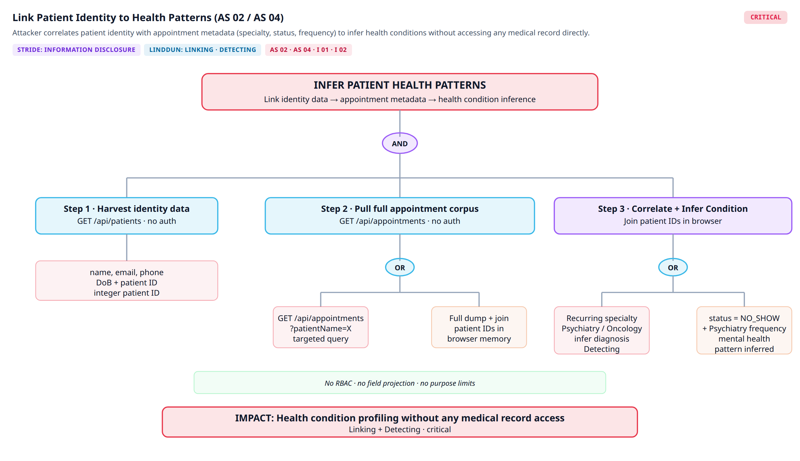

**Part 2 Regression:**

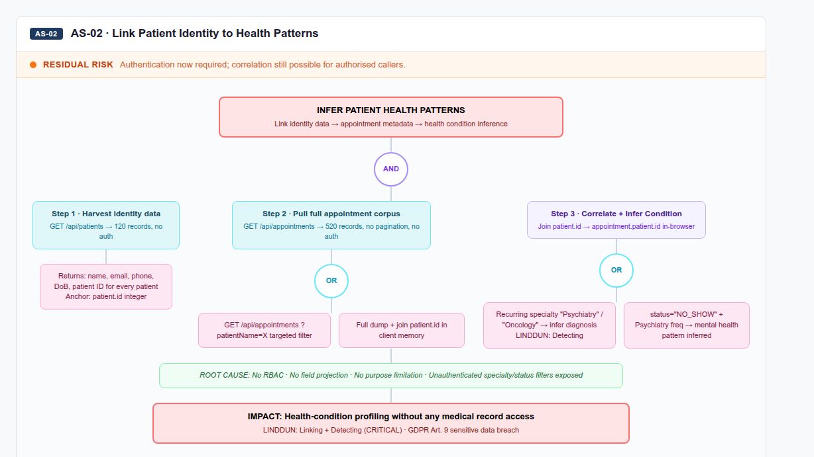

---

## AS-03 — Directly Identify a Patient from Stored Records

| Field | Detail |
|---|---|
| **LINDDUN** | Identifying — Critical |
| **Abuse Case** | As a malicious external user, I want to use personal identifiers stored in the system so that I can directly identify a patient and associate their appointment information with a real individual. |
| **How** | The attacker accesses records containing direct identifiers (name, email, phone, date of birth). Patient IDs are sequential integers starting at 1, making full enumeration via `/api/patients/{id}` trivial with no rate limiting or authentication. |
| **Impact** | A real individual can be directly identified and their full appointment history retrieved. |
| **Part 2 Status** | **Prevented** — Authentication blocks unauthenticated enumeration. `RateLimitFilter` limits authenticated callers to 60 req/min. Sequential IDs remain (future work: UUIDs). |

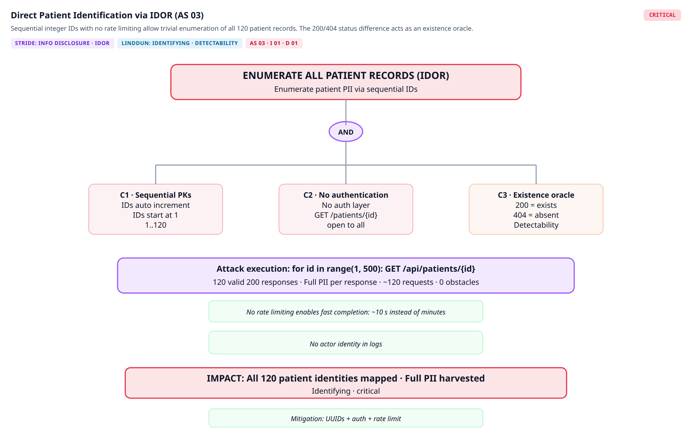

**Part 2 Regression:**

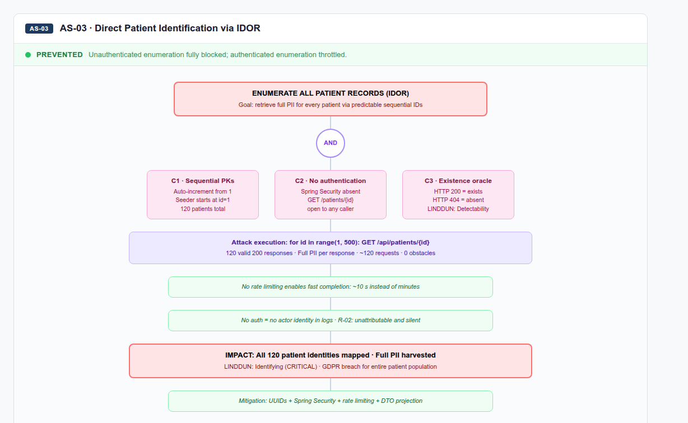

---

## AS-04 — Infer a Patient's Health Condition from Appointment Metadata

| Field | Detail |
|---|---|
| **LINDDUN** | Detecting — Critical |
| **Abuse Case** | As a malicious external user, I want to observe the specialty and status fields of a patient's appointments so that I can infer sensitive health information without ever accessing a medical record directly. |
| **How** | The attacker filters `GET /api/appointments?patientName=X` to retrieve the full appointment history. Repeated "Psychiatry" visits with status `NO_SHOW` reveal sensitive patterns without any explicit diagnosis data. |
| **Impact** | Sensitive health conditions may be inferred from observable metadata, constituting a privacy violation. |
| **Part 2 Status** | **Prevented** — Requires authentication; RBAC limits which roles can query appointments by patient name. |

**Part 2 Regression:**

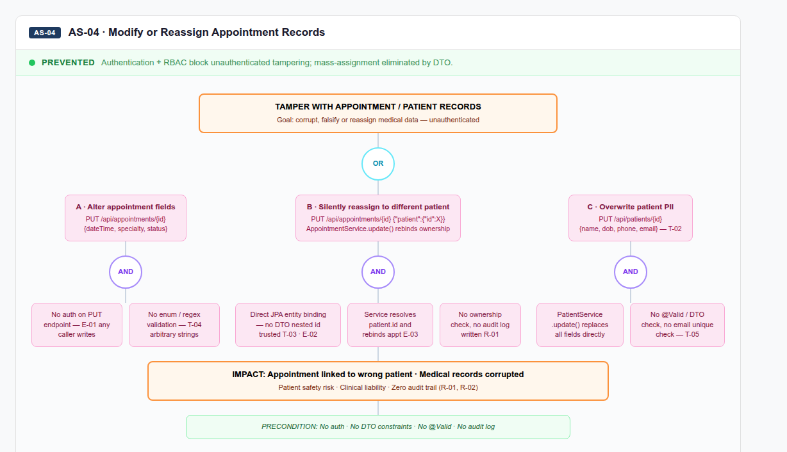

---

## AS-05 — Modify or Reassign Patient Appointment Records

| Field | Detail |
|---|---|
| **LINDDUN** | Disclosure — High |
| **Abuse Case** | As a malicious external user, I want to change the date, status, specialty, or linked patient of an appointment so that I can corrupt legitimate medical records. |
| **How** | The attacker sends an unauthenticated PUT to `/api/appointments/{id}`. Including `{"patient":{"id":X}}` in the body causes the service to silently reassign the appointment to a different patient, with no authorisation check or audit log. |
| **Impact** | Medical records may be altered or linked to the wrong patient, directly affecting clinical integrity and patient safety. |
| **Part 2 Status** | **Prevented** — `@PreAuthorize` enforces role-based write access; unauthenticated PUT returns 401. |

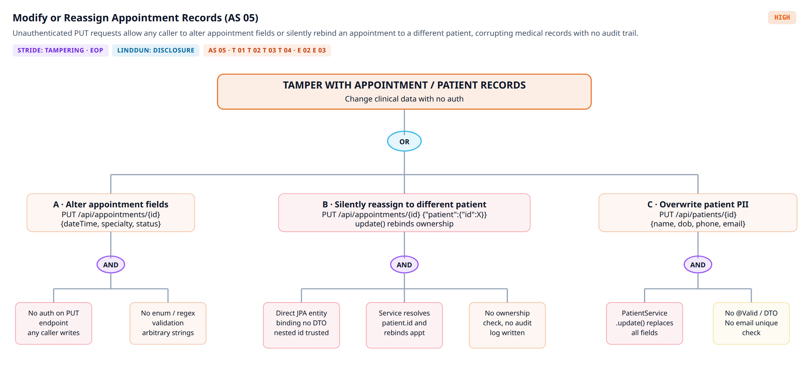

**Part 2 Regression:**

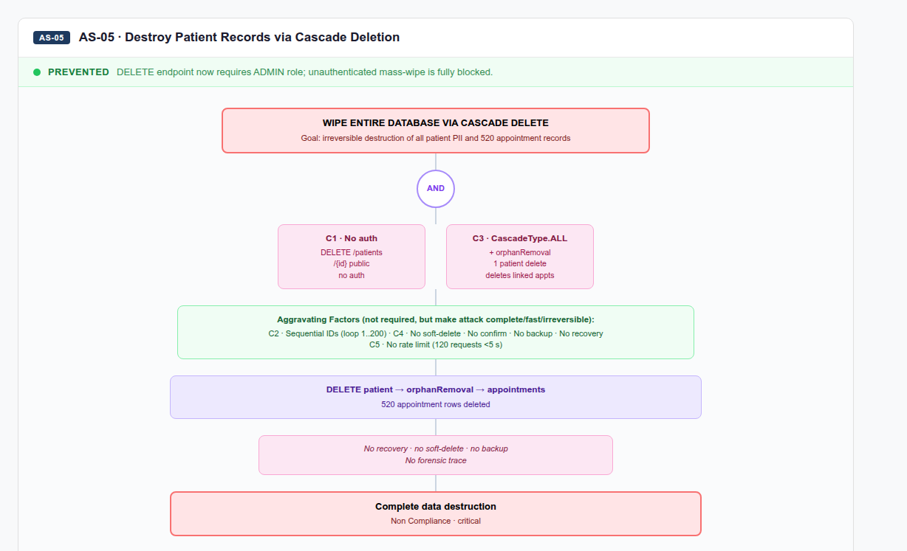

---

## AS-06 — Destroy Patient Records Through Cascade Deletion

| Field | Detail |
|---|---|
| **LINDDUN** | Non-Compliance — Critical |
| **Abuse Case** | As a malicious external user, I want to remove patient records so that I can cause irreversible data loss and disrupt normal clinical operation. |
| **How** | The attacker sends unauthenticated DELETE requests to `/api/patients/{id}`. Due to cascade deletion (`orphanRemoval=true`), every linked appointment is also permanently destroyed. Sequential IDs allow iterating from 1 to N to wipe the entire database. |
| **Impact** | All patient PII and linked appointment history is permanently lost with no recovery mechanism. |
| **Part 2 Status** | **Prevented** — DELETE requires ADMIN role. Soft-delete is implemented: `Patient` and `Appointment` carry a `deleted_at` timestamp; deletion sets this field instead of issuing a SQL DELETE. `@SQLRestriction` filters soft-deleted records from all queries. Data is never permanently destroyed by a single API call. |

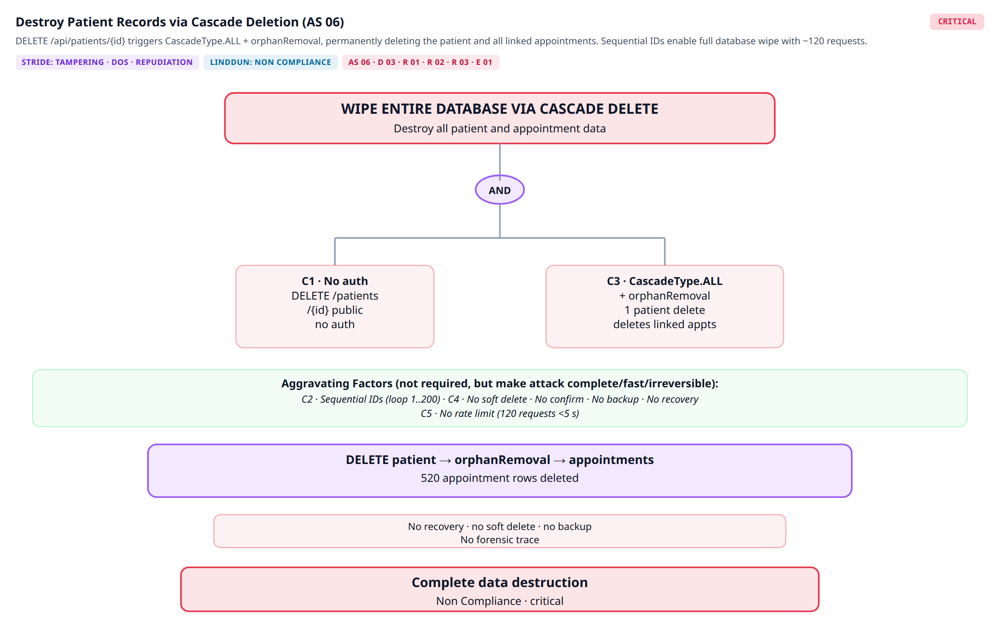

**Part 2 Regression:**

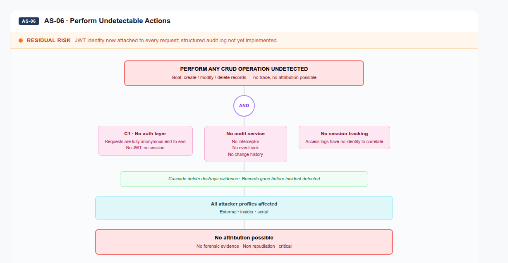

---

## AS-07 — Perform Undetectable Actions Due to Absence of Audit Logging

| Field | Detail |
|---|---|
| **LINDDUN** | Non-repudiation — Critical |
| **Abuse Case** | As a malicious internal user or external attacker, I want to create, modify, or delete patient and appointment records so that my actions leave no trace and cannot be attributed to me. |
| **How** | The system had no authentication, no audit log, and no access log at any layer. Any CRUD operation on any record was permanently undetectable once performed. |
| **Impact** | Malicious or accidental changes cannot be investigated or attributed. The clinic cannot comply with GDPR. |
| **Part 2 Status** | **Prevented** — A structured `audit_logs` table persists every CREATE, UPDATE, and DELETE with actor (JWT `sub`), resource, resource ID, and timestamp. The application database role has UPDATE and DELETE revoked on `audit_logs` at startup, making the trail tamper-proof: even a fully compromised backend cannot erase entries. ADMIN users can query the full trail via `GET /api/audit-logs`. |

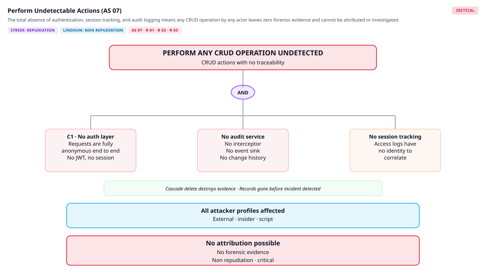

**Part 2 Regression:**

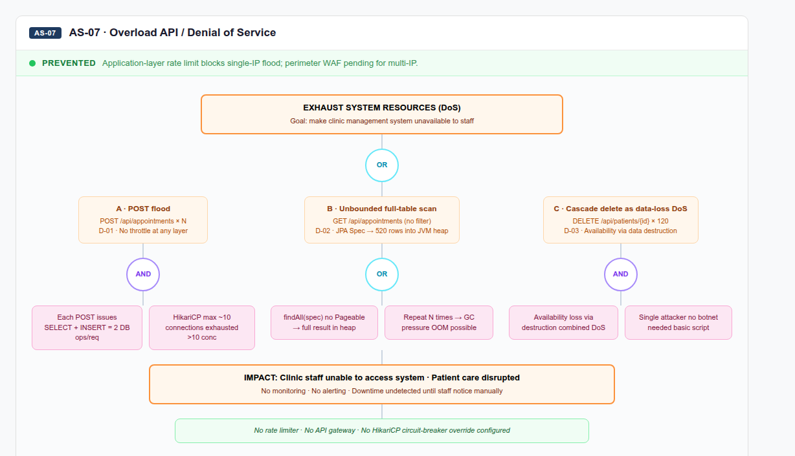

---

## AS-08 — Overload the API with Repeated Requests

| Field | Detail |
|---|---|
| **LINDDUN** | Non-compliance — High |
| **Abuse Case** | As an attacker, I want to flood patient and appointment endpoints with repeated requests so that I can make the system slow or unavailable for legitimate users. |
| **How** | The attacker automates repeated API requests. No rate limiting existed, and `GET /api/appointments` with no filters triggered a full table scan exhausting the HikariCP connection pool (~10 connections). |
| **Impact** | The system becomes slow or unavailable for normal clinical use. |
| **Part 2 Status** | **Prevented** — Dual-layer rate limiting: Nginx `limit_req_zone` (30 req/s burst / 10 req/s sustained per IP at the perimeter) and Spring `RateLimitFilter` (60 req/min per IP at the application layer). ModSecurity CRS request-body limits (1 MB) further constrain large-payload abuse. |

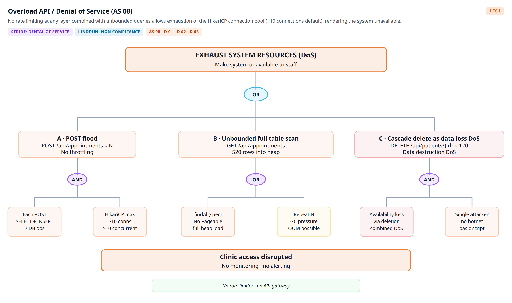

**Part 2 Regression:**

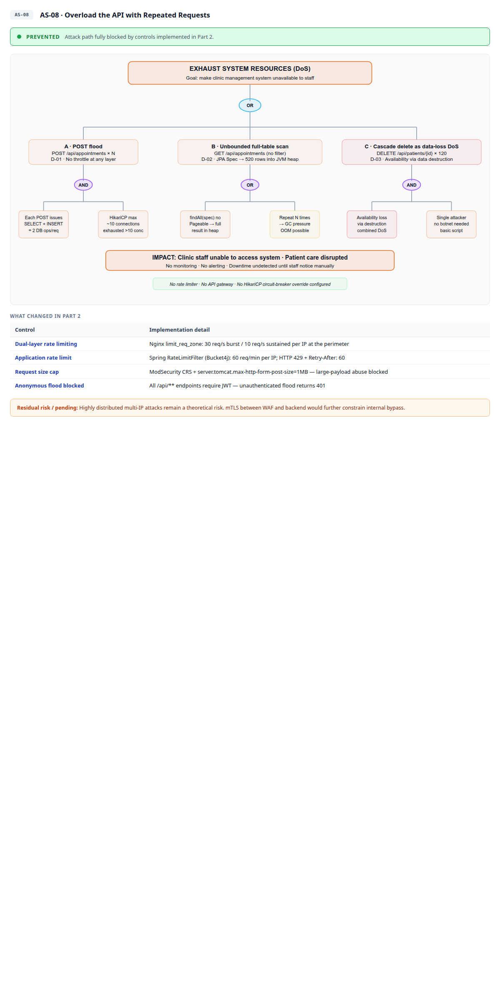
